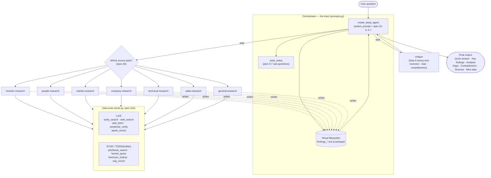

# Architecture

This project converts the **Research Agent build specification (v1.0)** into a
[LangChain deep agent](https://github.com/langchain-ai/deepagents). This page
explains how the pieces fit together and why.

## The shape of a deep agent

A "deep agent" is an orchestrator LLM with four standard capabilities baked in
by `deepagents`' default middleware:

1. **Planning** — a `write_todos` tool the orchestrator uses to lay out and
   track a multi-step plan.
2. **A virtual filesystem** — `write_file` / `read_file` / `ls` / `edit_file`
   tools backed by agent state, used as a scratchpad so detail is not lost in
   the chat transcript.
3. **Sub-agents** — a `task` tool that delegates a scoped job to a named
   specialist agent with its own context window and tool allow-list.
4. **Your tools** — whatever domain tools you register.

The spec maps onto these one-to-one:

| Spec concept | Deep-agents mechanism |
| --- | --- |
| Research process (Frame → Decompose → … → Stress-Test) | Orchestrator `system_prompt` + `write_todos` |
| Source packs (Section 4), each with its own tool routing order | One **sub-agent** per pack |
| Step 8 stress-test (inversion / bias / completeness) | A dedicated `critique` sub-agent |
| Carrying findings between steps without losing detail | The virtual filesystem (`findings_*.md`) |
| Verification layer (Perplexity, never the sole source) | `perplexity_verify`, reached last in every routing order |
| Confidence tags, evidence categories, anti-patterns | Shared prompt blocks injected into every agent |

## Architectural diagram



The same structure as text, for environments that do not render Mermaid:

## Component map

```
Orchestrator  (research_agent/prompts.py :: ORCHESTRATOR_INSTRUCTIONS)
  the "brain": spec sections 1-3, 5-7
  |
  |-- write_todos                 plan the research
  |-- write_file / read_file / ls scratchpad for findings
  |
  +-- task --> sub-agents  (research_agent/subagents.py, spec section 4)
        investor-research    people-research     market-research
        company-research     technical-research  sales-research
        general-research     critique
              |
              +-- data tools  (research_agent/tools.py, spec section 10)
                    Live:  tavily_search  web_search  web_fetch
                           perplexity_verify  apollo_enrich
                    Stub:  pitchbook_search  factset_query
                           harmonic_lookup   clay_enrich
```

## Data flow for one request

1. The orchestrator receives the question and frames it. If it is vague, it
   stops and asks the user (spec core principle).
2. It decomposes the question into 3-7 sub-questions with `write_todos`.
3. It picks the matching pack and calls `task` to delegate to that sub-agent.
   The sub-agent follows its tool routing order, triangulates across sources,
   and writes a structured `findings_<pack>.md` with each claim tagged.
4. The orchestrator reads the findings file, synthesises, then delegates to
   `critique` for the Step 8 stress-test.
5. It applies the critique's fixes and produces the final output in the
   mandated structure (Quick answer → Key findings → Analysis → Gaps →
   Contradictions → Sources → Next step), then asks where to send it.

## Why sub-agents per pack

Each pack has a different tool routing order and different required output
fields. Giving each pack its own sub-agent means:

- The pack's instructions stay focused and do not bloat the orchestrator.
- Each pack runs in a fresh context window, so a deep investor dig does not
  crowd out a later market-sizing step.
- Tool access is scoped: the `people-research` agent gets Apollo and Clay; the
  `market-research` agent does not. This keeps the model from reaching for the
  wrong tool.

## Where the "rules" live

The non-negotiable rules (triangulation, confidence tags, gaps are mandatory,
never fabricate, stop when uncertain) are defined once in `prompts.py` as
reusable blocks and injected into both the orchestrator and every sub-agent.
That way a sub-agent running in isolation still carries the full standard, and
there is a single place to edit a rule.

## Files

| File | Responsibility |
| --- | --- |
| `research_agent/prompts.py` | Orchestrator brain + shared rule blocks |
| `research_agent/subagents.py` | One `SubAgent` dict per source pack |
| `research_agent/tools.py` | Tool implementations (live) and stubs (premium) |
| `research_agent/agent.py` | Assembles everything via `create_deep_agent` |
| `main.py` | CLI entrypoint (one-off and interactive) |
| `tests/` | Structural checks + the 7 spec validation cases |
